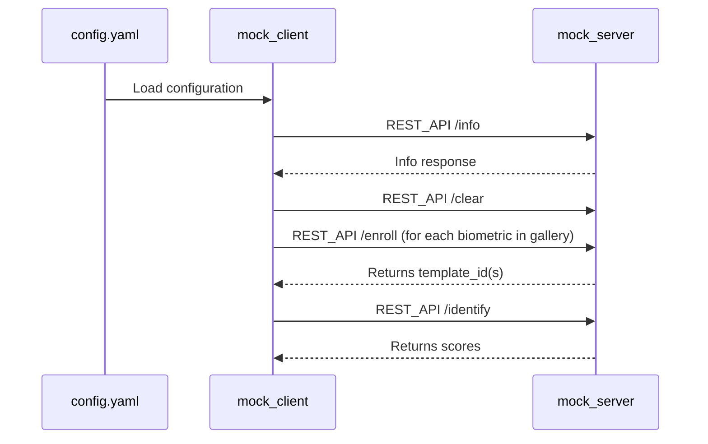

# Mock Biometric Test Server

This is a mock biometric API server designed for use in biometric Proof-of-Concept (PoC) environments. It simulates biometric **enrolment**, **identification**, and **gallery management**, exposing a simple REST API with interactive Swagger documentation. 

## Features

- REST API endpoints: **GET /info**, **POST /enroll**, **POST /identify**, **POST /verify**, **POST /clear**, **POST /pad**, **GET /quit**

- **/info** is the only manditory endpoint - all others depend on what is required to be tested.

- Input: Base64-encoded images
- Output: simulated template IDs, match scores, liveness decisions, and processing time (ms)
- Interactive Swagger UI (if `flasgger` is installed) at `/apidocs/`

> [!IMPORTANT]
> * The implementation provided is in Python, however any language can be used where the REST endpoints can exposed.
> * API authentication can be support through x-API-Key set in the header
> * Note this currently only designed be run completely inside a secure trusted testing network, and so there is currently no encryption on REST calls - although SSL is easily supported.

---

## Requirements

- cmake
- Python >= 3.8, <= 3.10
- pip
- supply your own biometric image (default `testdata/face1.png`)


### Install dependencies

```bash
# Core dependencies
pip install flask

# Dependencies for Mock client for integration tests
pip install requests

# Optional dependencies for Swagger UI (interactive docs)
pip install flasgger

# Optional dependencies if running servers/py_facerec.py (mock face recognition server)
pip install face_recognition numpy Pillow
```

---

## Running the Server

```bash
python mock_server.py
```
The server will start on `http://localhost:5001`. If the optional `flasgger` package is installed,
interactive API documentation is available at:

```
http://localhost:5001/apidocs/
```

---

## Running the Client

```bash
python mock_client.py
```
The client will run a range of tests on the server defined in config.yaml

```yaml
default:
  name: "Default Configuration"
  url: "http://127.0.0.1:5001"
  api_key: this_is_a_secret_key
  test_image_path: testdata/face1.png
  gallery: testdata/gallery
  probes: testdata/probes
```

An example output is below:

```bash
python3 mock_client.py

ℹ️ Testing /info endpoint...
✅ Info success: {'company': 'Open Source python face_recognition', 'description': 'A simple API for face recognition operations.', 'end_points': {'clear': '/clear', 'enroll': '/enroll', 'identify': '/identify', 'info': '/info', 'quit': '/quit', 'verify': '/verify'}, 'gallery_size': 0, 'product_name': ' face_recognition', 'thresholds': {'identification': 0.6, 'verification': 0.6}, 'version': '1.2.3'}
Available endpoints: {'clear': '/clear', 'enroll': '/enroll', 'identify': '/identify', 'info': '/info', 'quit': '/quit', 'verify': '/verify'}

🔄 Clearing gallery...
✅ Clear success: {'message': 'Template gallery cleared', 'processing_time_ms': 0}

🔎 Testing /identify on empty gallery...
✅ Identify success: 0 match(es)

📝 Enrolling 5 images...
✅ Enroll success: {'processing_time_ms': 845, 'template_id': '55acef9c-083b-4e02-adfa-25e4695de4c4'}
✅ Enroll success: {'processing_time_ms': 815, 'template_id': 'a44dd4bf-aee9-4e7f-9123-0a62869cf377'}
✅ Enroll success: {'processing_time_ms': 809, 'template_id': '5ef6422b-7a36-4b40-aba9-c3531baad50f'}
✅ Enroll success: {'processing_time_ms': 817, 'template_id': 'affd1580-47d1-4b1f-9c59-8f9069393335'}
✅ Enroll success: {'processing_time_ms': 815, 'template_id': 'cde2dac9-f1b5-4009-8f4b-25216472d7c9'}

🔎 Testing /identify with top_k=3...
✅ Identify success: 3 match(es)

🔎 Testing /identify with top_k=7 (larger than gallery)...
✅ Identify success: 5 match(es)

🔄 Clearing gallery for single-item test...
✅ Clear success: {'message': 'Template gallery cleared', 'processing_time_ms': 0}

📝 Enrolling 1 image...
✅ Enroll success: {'processing_time_ms': 815, 'template_id': '8252f00f-36de-45bb-9d15-4c35e445d890'}

🔎 Testing /identify for gallery of one...
✅ Identify success: 1 match(es)

🧪 Testing /verify endpoint with same image pair...
✅ Verify success: {'decision': True, 'processing_time_ms': 1635, 'score': 1.0}

🎃 Testing /pad endpoint...
⚠️ Warning: 'pad' endpoint not defined in end_points

✅ All endpoint tests passed successfully.
✅ Quit success: {'message': 'Server is shutting down...'}

👋 Server shutdown initiated
```
---

## Example of Identify Calls


---


## API Endpoints


### 🔹 `GET /info`

Get information about the tested algorithm and discover supported endpoints. This endpoint is **mandatory** for all servers. Servers may implement additional endpoints beyond those listed; clients should inspect `/info` to determine available functionality.

#### Success Response:

```json
{
  "company": "BixeLab",
  "product_name": "Mock Biometric Test Server",
  "version": "1.0.0",
  "thresholds": { "identify": 0.5, "verify": 0.75 }, # note this is optional, values supplied here will be assumed as suggested operational points
  "description": "A mock biometric API for PoC and testing, no real biometric algorithm used.",
  "api_key_required": false, # specify if an api key is needed - if so it will be sent in the header
  "endpoints": {
    "info": "/info",
    "enroll": "/enroll",
    "identify": "/identify",
    "verify": "/verify",
    "clear": "/clear",
    "pad": "/pad",
    "quit": "/quit"
  }
}
```

---

### 🔹 `POST /enroll`

Enrolls a biometric template from a Base64-encoded image.

#### Request Body:

```json
{
  "image": "<base64-encoded-image>"
}
```

#### Success Response:

```json
{
  "template_id": "uuid-string",
  "processing_time_ms": 3
}
```

#### Error Response:
e.g.
```json
{
   "error": "FTE: Unable to decode image"
}
```
---

### 🔹 `POST /identify`

Identify enrolled templates matching the provided image.

> **Note:** `/identify` returns matches only for templates previously enrolled via `/enroll`. Ensure you call `/enroll` first to populate the template gallery.

#### Request Body:

```json
{
  "image": "<base64-encoded-image>",
  "top_k": 50            # Number of top matches to return (1–100, default=100)
}
```

#### Success Response:

```json
{
  "matches": [
    {"template_id": "uuid-1",
     "score": 0.982, 
      "decision": true      # Optional: indicates whether the match passes the identification threshold
    },
    ...
  ],
 
  "processing_time_ms": 5
}
```

#### Error Response:
e.g.
```json
{
   "error": "FTA: Unable to decode image"
}
```
---

### 🔹 `POST /clear`

Clears the biometric gallery.

#### Success Response:

```json
{
  "message": "Template gallery cleared",
  "processing_time_ms": 1
}
```


---

### 🔹 `POST /verify`

Verify two biometric images (one-to-one).

> **Note:** the `decision` field in the success response is optional and may be omitted by the server.

#### Request Body:

```json
{
  "image1": "<base64-encoded-image>",
  "image2": "<base64-encoded-image>"
}
```

#### Success Response:

```json
{
  "score": 0.8321,
  "decision": true,
  "processing_time_ms": 4
}
```

#### Error Response:

```json
{
  "error": "FTE: Missing or invalid image input",
  "processing_time_ms": 2
}
```
---

## 🔍 Passive PAD (Presentation Attack Detection)

### 🔹 `POST /pad`

Simulates a passive PAD check to determine whether a biometric image represents a live person or a spoof (e.g. printed photo or screen replay).

#### Request Body:
```json
{
  "image": "<base64-encoded-image>"
}
```

#### Response:
```json
{
  "is_live": true,
  "reason": "Face structure consistent with live subject",
  "processing_time_ms": 3
}
```
Response includes a human-readable explanation and processing time.

Intended for testing integration and fallback logic in client applications.

---

### 🔹 `GET /quit`

Gracefully shut down the server. No request body is required.

#### Success Response:

```json
{
  "message": "Server is shutting down..."
}
```
Clients can invoke this endpoint to terminate the server process.

## Testing the API

A sample client (`mock_client.py`) is provided to show how interaction with the server work. You can also use Swagger UI or tools like Postman.

In practice this can be used to test the interfaces of your server.

---

> [!NOTE] 
> * This is a **mock application only** for integration testing. 
> * The `TEMPLATE_DB` for the mock is stored in memory and cleared on restart or via `/clear`.
> * Intended for PoC and testing integrations in secure environments (e.g. behind VPN).

---

## Automated Server Testing

A test runner (`test_servers.py`) is provided to start each Python server in the `servers/` directory and run the integration suite (`mock_client.py`) against it:

```bash
python test_servers.py
```

## Face Recognition Server Example

The `servers/py_facerec.py` script demonstrates an open source face recognition implementation. Below is a minimal snippet illustrating the `/verify`, `/identify`, and `/enroll` endpoints:

```python
from flask import Flask, request, jsonify
import time, base64, io, uuid
import face_recognition
from PIL import Image
import numpy as np

app = Flask(__name__)
known_encodings = []
known_ids = []
DEFAULT_TOLERANCE = 0.6

API_KEY = 'this_is_a_secret_key'  # Replace with your actual API key

def require_api_key(f):
    """Decorator to require API key for endpoints."""
    def decorated_function(*args, **kwargs):
        api_key = request.headers.get('X-API-Key')
        if api_key != API_KEY:
            return jsonify({'error': 'Unauthorized'}), 401
        return f(*args, **kwargs)
    return decorated_function

def decode_image(b64):
    image = Image.open(io.BytesIO(base64.b64decode(b64)))
    if image.mode != 'RGB':
        image = image.convert('RGB')
    return np.array(image)

@app.route('/verify', methods=['POST'])
@require_api_key
def verify():
    start = time.time()
    data = request.json or {}
    img1 = decode_image(data['image1'])
    img2 = decode_image(data['image2'])
    enc1 = face_recognition.face_encodings(img1)[0]
    enc2 = face_recognition.face_encodings(img2)[0]
    dist = face_recognition.face_distance([enc1], enc2)[0]
    score = round(1.0 - dist, 4)
    decision = dist <= DEFAULT_TOLERANCE
    return jsonify({
        'score': score,
        'decision': decision,
        'processing_time_ms': int((time.time() - start)*1000)
    })

@app.route('/identify', methods=['POST'])
@require_api_key
def identify():
    start = time.time()
    data = request.json or {}
    target = face_recognition.face_encodings(decode_image(data['image']))[0]
    distances = face_recognition.face_distance(known_encodings, target)
    matches = sorted([
        {'template_id': tid, 'score': round(1.0 - d, 4)}
        for tid, d in zip(known_ids, distances)
    ], key=lambda x: x['score'], reverse=True)[:data.get('top_k', 100)]
    return jsonify({
        'matches': matches,
        'processing_time_ms': int((time.time() - start)*1000)
    })
    
@app.route('/enroll', methods=['POST'])
@require_api_key
def enroll():
    start = time.time()
    data = request.json or {}
    image = decode_image(data['image'])
    encoding = face_recognition.face_encodings(image)[0]
    template_id = str(uuid.uuid4())
    known_encodings.append(encoding)
    known_ids.append(template_id)
    return jsonify({
        'template_id': template_id,
        'processing_time_ms': int((time.time() - start)*1000)
    })

@app.route('/info', methods=['GET'])
def info():
    return jsonify({
        'company': 'Face Recognition Inc.',
        'product_name': 'Face Recognition API',
        'version': '1.0.0',
        'description': 'A simple API for face recognition operations.',
        'thresholds': {
            'identify': DEFAULT_TOLERANCE,
            'verify': DEFAULT_TOLERANCE
        },
        'endpoints': {
            'info': '/info',
            'enroll': '/enroll',
            'identify': '/identify',
            'verify': '/verify'
        }
    })
```

---

## License

MIT – Use freely with attribution.

---

## Author

Dr. Ted Dunstone
CEO, BixeLab
[https://bixelab.com](https://bixelab.com)
